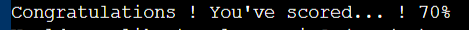
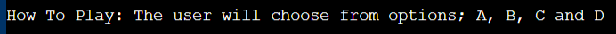
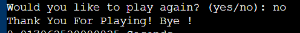
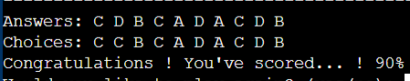

# Gamebox App - Project 3

Gamebox App live link - https://gamebox-quiz-app-bd65f9b140e9.herokuapp.com/

###  Gamebox App Heading

- Featured at the top of the page is the Gamebox app heading and is easy to see for the users.
Upon viewing the page, the user will be able to see the name of the game and a start game button!

## Purpose
Gamebox App is a quiz app designed for people to engage their mind or test their knowledge in a kind coffee break situation. You can find the live link here - https://gamebox-quiz-app-bd65f9b140e9.herokuapp.com/

 Gamebox is easy to play game app, perfect for want to try out new things. User will go by choosing their prefer answers within the aphabet A, B, C and D.

The quiz has 10 questions in total and the player gets 10% per point on each question answered correctly.

The questions flow in orderly, one after the other as next question displays once user picks an answer.

At the end of the quiz the app displays user time spent by seconds and scores percentage.

This quiz game app demonstrate how Python works in a real-world context, and can be played by anyone who finds it interesting. The questions are carefully selected to make user to want to play more.

The site is a fully responsive python game that will allow users to read a question regardless of the screen size.

## Features

### Existing Features
-
-

### The Game Area

- The quiz game site has a welcome message for user followed by a question if user wants to play the quiz.

- If user types yes then the quiz rules will be displayed but if user types no then the game ends.

- The quiz are 10 questions that display one after the other when user chooses answer.
- Once the user types in an answer, its irreversible. If player is correct it will display "Weldone! The answer is correct!" and if the answer is incorrect, it will print "Wrong Answer". At the end of the game result will be displayed and user can see both prefered answers and correct answers.

- At the end the user will get a thank you message followed by their score and as well a message to direct the user where to click if user wants to try again.

### The Score Area

- The user will only see result at the end of the game.

## First Time Visitor Goal

- As a first-time user I want to easily understand what the site main purpose is all about.

- As first-time user I use my phone often, so I want to view the website content clearly on my mobile.

- As a first-time user I want to found the site interesting.

## Returning Visitors Goals

- As a returning user I want to play the game again

### Features Left to Implement
- 

## Testing

### Validator Testing
- I have tested this project code by:
- Pasting the code on PEP8 linter and there were no error found. 
- Tested after deployment on Code Institute Heroku terminal and it run successfully.

### Debug

- Wrong identation fixed. 

## Deployment

This project was deployed using Code Institute's mock terminal for Heroku and the steps for deployment are as followed:
### First step
- Sign in to Heroku app
- Create a new app with a unique name
- Go to setting and create a _Config Var_ called `PORT`. Set the value to `8000`
- Then click on  buildpacks and add the following:
1. `heroku/python`
2. `heroku/nodejs`

### Second step
- Click on deploy at the top left side and select github to connect to github. Confirm your connection and 
  search for the github repository name, click connect to link up the Heroku app earlier creacted with the repository.
- Choose either automatic deploy or manual. I used manual which is deploy branch.
- Allow the app to build until it shows successfully then click view and it takes me to my live deployed link.

### Credit 
- Bro Code Youtube Channel
- Google Search Engine