# Gamebox App - Project 3

Gamebox App live link - [Open game on browser](https://gamebox-quiz-app-bd65f9b140e9.herokuapp.com/)

### Introduction to the project

The program created is an online quiz game on things to know about sweden

[Delpoyed link](https://gamebox-quiz-app-bd65f9b140e9.herokuapp.com/) Leads to my deployed project.

###  Gamebox App Heading

- Featured at the top of the page is the Gamebox app heading and is easy to see for the users.
Upon viewing the page, the user will be able to see the name of the game and a start game button!

### Gameplay

First, the player is asked if he wants to play giving option to play or quit. If player choses "y" the game rules will be displayed but if the player input is not "y", the game ends. If player input is y and the game rules is displayed, the player is asked to type "s" to start or "q" to quit. If the player input is not "s", the game end but if the player input is "s" indicating interest in playing the game, the player is asked to enter his name. This allows the computer to address the player directly. When the game has started.

### Target audience

- People who like Browsergamers.
- People who want to pass some free time.
- People who want to like quiz game.

### User story

As a first time user of the game, you want to:
- As a first-time user I want to easily understand what the site main purpose is all about.
- As first-time user I use my phone often, so I want to view the website content clearly on my mobile.
- As a first-time user I want to found the site interesting.
- Play a bug-free game.
- Play a self-explanatory game.
- Be able to navigate easily over the terminal window.
- I would like to be able to read the rules of the game.

As a frequent user of the website, you want to:
- Repeat the game experience.
- Improve the last game result.

Objectives of the website operator is to:
- Provide an easy to navigate and to play game.
- Provide a feedback of all user inputs.
- Provide an error free game.
- Provide an entertaining diversion to pass the time.

How this requirements are met:
- The game will be free to play.
- There will be a welcome screen from which the player can navigate.
- All important elements will be shown in the terminal.
- A response is given to every user input, especially if the input is not expected by the computer.
- The player can see the rules of the game.
- There is always the possibility to quit the game before the quiz starts.

## Purpose
Gamebox App is a quiz app designed for people to engage their mind or test their knowledge in a kind coffee break situation. You can find the live link here - [Delpoyed link](https://gamebox-quiz-app-bd65f9b140e9.herokuapp.com/)

 Gamebox is easy to play game app, perfect for who want to try out new things. User will go by choosing their prefer answers within the aphabet A, B, C and D.

The quiz has 10 questions in total and the player gets 10% per point on each question answered correctly.

The questions flow in orderly, one after the other as next question displays once user picks an answer.

At the end of the quiz the app displays user scores by percentage.

This quiz game app demonstrate how Python works in a real-world context, and can be played by anyone who finds it interesting. The questions are carefully selected to make user to want to play more.

The site is a fully responsive python game that will allow users to read a question regardless of the screen size.

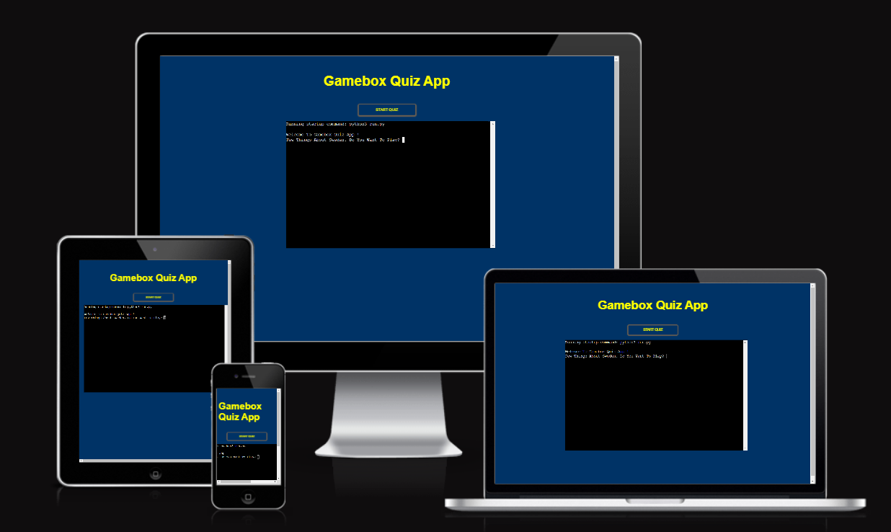

## Features

### Existing Features

### The Game Area

- The quiz game site has a welcome message for user followed by a question if user wants to play the quiz.

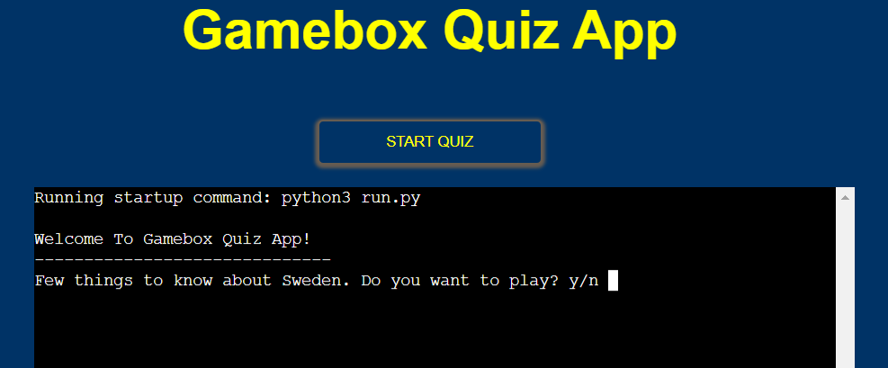

- If user types y then the quiz rules will be displayed but if user types n or any other input then the game ends.
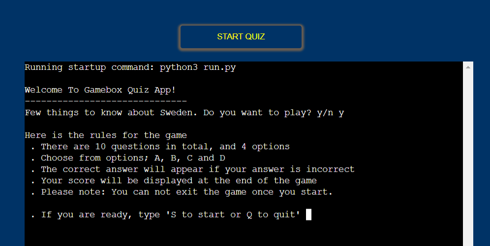
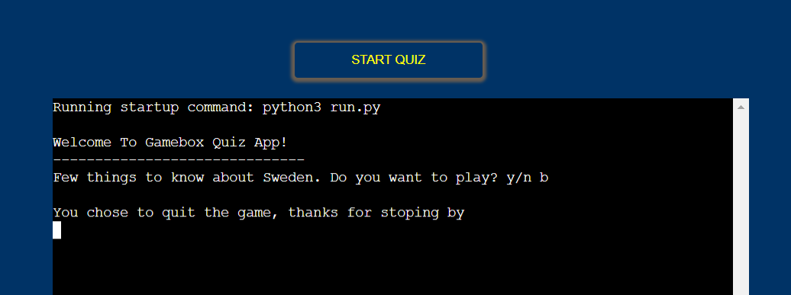

- Once the user types in an answer, its irreversible. If player is correct it will display "Weldone! The answer is correct!" and 
 and if user input is not A, B, C OR D it will print Invalid input telling user to choose A,B,C,D. And if the answer is incorrect, it will print "Wrong Answer" and print the correct answer

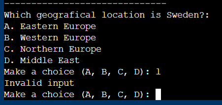

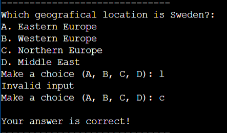

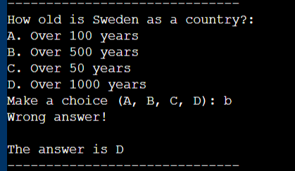

- At the end of the game, the user will get a thank you message followed by their score and as well a message to direct the user where to click if user wants to try again. OS is used to clear the gameboard before displaying user result.
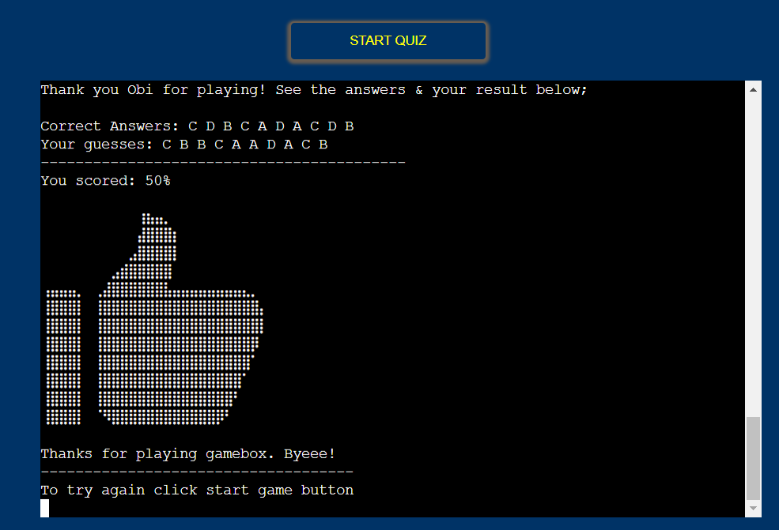

### The Score Area

- The user will only see result at the end of the game.

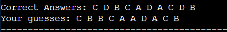

### Features Left to Implement
- Time to answer each question
## Testing

### Validator Testing
- I have tested this project code by:
- Pasting the code on PEP8 linter and there were no error found. 
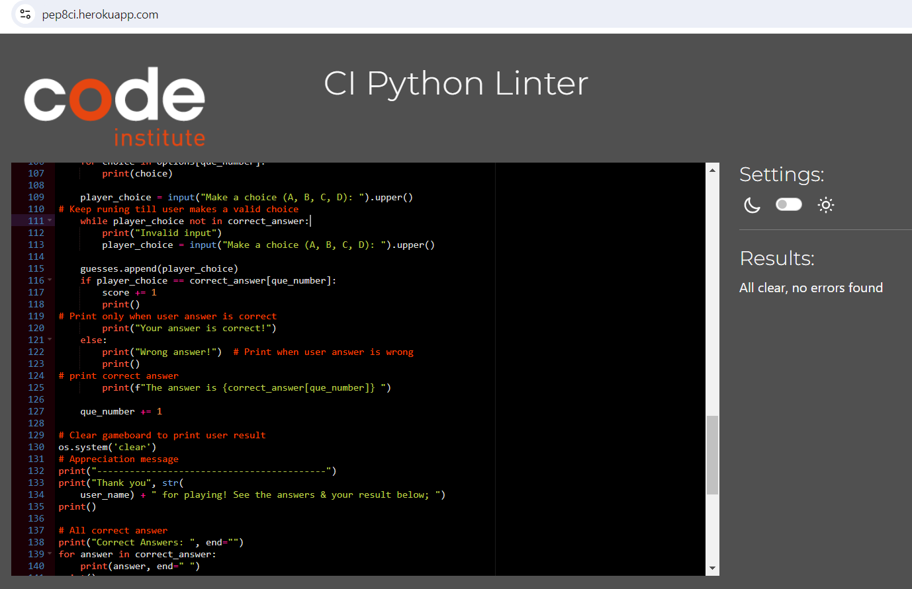
- Tested after deployment on Code Institute Heroku terminal and it run successfully.

### Debug

- Wrong identation fixed. 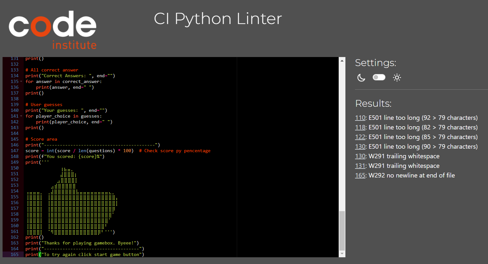

## Technologies used

### Languages used
Python is used for the project. For the landingpage HTML, CSS were used to customised the look.

### Software used
Gitpod - To code the project.  
Git - For version control.  
Github - To store to project.  
Heroku – To deploy the project.  
Ci Python Linter – To validate the python code.  

### Data model
Data is stored in variables in this project. This includes the user_name which is entered by the player and is also printed in the terminal to address the player by name. 
In addition, inputs from the player are processed in the menus.

## Deployment
The project was coded with codeinstitute-ide.net, stored on github and then deployed on Heroku. 
That is how the deployment was done:

1.  Pushed the latested code to Github.
2.	Log in to Heroku or create an account first.
3.	Click on the New Button on the dashboard in the top right corner.
4.	Click on "Create new app".
5.	Select the relevant region. In my case, I chose Europe.
6.  Select an app name that does not yet exist on heroku.
7.	Click on the "Create app" button.
8.	Click on the settings tab.
9.	Scroll to the buildpacks and click on "add buildpack," select "Python," and click "Add Buildpack".
10.	Repeat last step and add "node.js" buildpack.  
    IMPORTANT: First the python buildpack must be displayed, then the pack from node.js. It can be moved via drag and drop. 
11.	Click on the deploy tab.
12.	Click on Github as the deployment method.
13.	Search for the repository name and click on conncet.
14.	Select Enable Automatic Deploys"
15. Click on "Deploy Branch"
16. Click on the "View" button which leads to the deployed app

### Content for the project
The content of this project was written by Madu Omenka.

## Credit 
- Bro Code Youtube Channel
- Google Search Engine

 
**This project is for educational use only and was created for the Code Institute course Full stack software development byMadu Omenka.**
[Back to top](#top)
